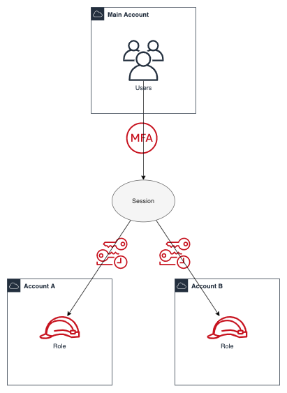
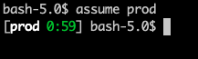
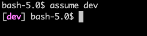
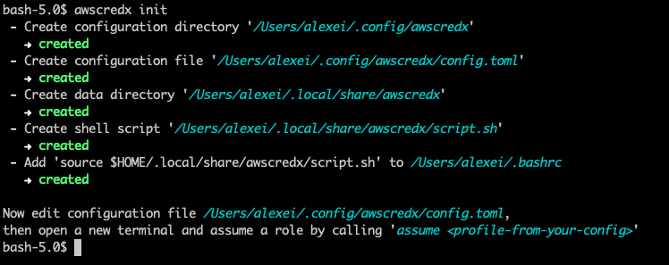
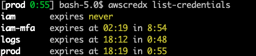
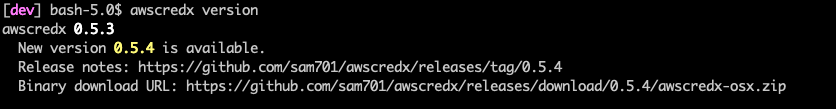

# AWSCREDX
[](https://travis-ci.org/sam701/awscredx)

Assume AWS roles under the motto "don't make me think".
`awscredx` has a goal to make the role assumption on the command line simple and intuitive.



## How to use it
Download the [binary](https://github.com/sam701/awscredx/releases/latest).
Add `awscredx` into your `PATH` and call `awscredx init`.
It will print what it has done.

The `awscredx init` sets up a shell script with the function `assume`.
In a new shell you can call `assume <profile name>` to assume the role from `<profile name>`. 

## Features

### Shows assumed profile with "expires in" in shell prompt
* Fancy colorful profile name in your prompt.
* Support for `bash`, `zsh` and `fish`.



### Configurable role profiles
Well documented [configuration file](./src/init/config-template.toml).
```toml
[profiles]
dev = "arn:aws:iam::123456589012:role/Admin"
prod = "arn:aws:iam::123456589013:role/TestRole"
```

### Role chaining
You can assume a role `k8s-admin` from a role `prod` that is in turn assumed from your main account credentials.
```toml
[profiles.k8s-admin]
role_arn = "arn:aws:iam::123456589014:role/K8sAdminRole"
parent_profile = "prod"
```

### Optional automatic access key rotation
```toml
# Uncomment the following line to enable automatic credentials rotation of the main profile every N days.
# rotate_credentials_days = 7
```

### Yubikey integration
The MFA is read from your Yubikey so you do not need to type it.\


### Simple installation
It is just a single [binary](https://github.com/sam701/awscredx/releases/latest) that creates all required helper shell scripts.
It explains what has been done.


### Lists current credentials with their expiration times


### Checks for new versions


### Supports `HTTPS_PROXY` envvar
In case you are behind a corporate proxy.

### Written with love in Rust
https://www.rust-lang.org/

## License
MIT